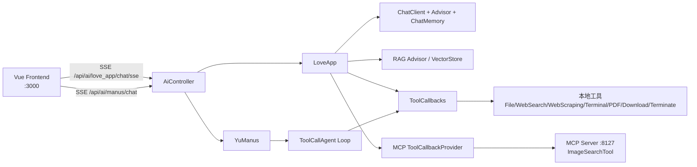

#鱼皮的AI 超级智能体项目
- 主流 AI 应用平台的使用
- AI 大模型的 4 种接入方式
- AI 开发框架（Spring AI + LangChain4j）
- AI 大模型本地部署
- Prompt 工程和优化技巧
- Spring AI 核心特性：如自定义 Advisor、对话记忆、结构化输出
- RAG 知识库实战、原理和调优技巧
- PgVector 向量数据库 + 云数据库服务
- Tool Calling 工具调用实战及原理
- MCP 模型上下文协议和服务开发
- AI 智能体 Manus 原理和自主开发
- AI 服务化和 Serverless 部署上线
- 各种新概念：如多模态、智能体工作流、A2A 协议、大模型评估等

## 项目功能梳理

项目中，我们将开发一个 AI 恋爱大师应用、一个拥有自主规划能力的超级智能体，以及一系列工具和 MCP 服务。

具体需求如下：

- AI 恋爱大师应用：用户在恋爱过程中难免遇到各种难题，让 AI 为用户提供贴心情感指导。支持多轮对话、对话记忆持久化、RAG 知识库检索、工具调用、MCP 服务调用。
- AI 超级智能体：可以根据用户的需求，自主推理和行动，直到完成目标。
- 提供给 AI 的工具：包括联网搜索、文件操作、网页抓取、资源下载、终端操作、PDF 生成。
- AI MCP 服务：可以从特定网站搜索图片。

## 后端代码模块说明（新手速读）

为了帮助不熟悉 Java 架构的同学快速上手，在各个后端模块都补充了 `package-info.java` 注释。下面是模块职责总览：

| 模块 | 路径 | 作用 |
| --- | --- | --- |
| 主包 | `com.yupi.yuaiagent` | 后端代码根命名空间，组织所有业务模块。 |
| Controller | `com.yupi.yuaiagent.controller` | 提供 HTTP 接口（健康检查、AI 对话入口等）。 |
| Agent | `com.yupi.yuaiagent.agent` | 智能体推理、工具编排、任务执行核心。 |
| Agent Model | `com.yupi.yuaiagent.agent.model` | 智能体运行状态、上下文等结构定义。 |
| App | `com.yupi.yuaiagent.app` | 面向业务场景的应用封装（如恋爱大师）。 |
| Advisor | `com.yupi.yuaiagent.advisor` | 会话增强能力（日志、重读等）。 |
| RAG | `com.yupi.yuaiagent.rag` | 知识库加载、分片、检索与查询增强。 |
| Tools | `com.yupi.yuaiagent.tools` | Agent 可调用的外部工具（搜索/抓取/文件/PDF 等）。 |
| ChatMemory | `com.yupi.yuaiagent.chatmemory` | 对话历史持久化与多轮上下文管理。 |
| Config | `com.yupi.yuaiagent.config` | 全局配置（CORS、Bean 装配等）。 |
| Constant | `com.yupi.yuaiagent.constant` | 项目共享常量定义。 |
| Demo Invoke | `com.yupi.yuaiagent.demo.invoke` | 多种模型接入方式示例。 |
| Demo RAG | `com.yupi.yuaiagent.demo.rag` | RAG 实验与示例代码。 |
| MCP Server | `com.yupi.yuimagesearchmcpserver` | 独立图像搜索 MCP 服务。 |
| MCP Tools | `com.yupi.yuimagesearchmcpserver.tools` | MCP 图像搜索工具实现。 |

> 你可以直接打开上述模块目录下的 `package-info.java`，优先阅读每个模块注释，再看具体类代码。

## 后端“按包逐文件”职责清单（Java 类级别）

> 说明：以下按 **包 -> 文件** 展开，便于新同学快速定位“某个类具体做什么”。

### 1）主工程 `src/main/java/com/yupi/yuaiagent`

#### `com.yupi.yuaiagent`
- `YuAiAgentApplication`：Spring Boot 启动入口，负责拉起后端应用。
- `package-info.java`：主包说明，定义该层作为业务聚合根。

#### `com.yupi.yuaiagent.controller`
- `AiController`：统一 AI HTTP 入口，暴露恋爱大师（同步/SSE）与超级智能体（SSE）接口。
- `HealthController`：健康检查接口，供前端/运维验证服务存活。
- `package-info.java`：Controller 分层职责说明。

#### `com.yupi.yuaiagent.app`
- `LoveApp`：恋爱大师应用服务层，封装 ChatClient、会话记忆、RAG、Tool Calling、MCP 调用能力。
- `package-info.java`：应用层职责说明（面向业务场景编排）。

#### `com.yupi.yuaiagent.agent`
- `BaseAgent`：智能体抽象基类，定义状态、步骤推进、流式输出等通用能力。
- `ToolCallAgent`：支持工具调用的智能体实现，负责将工具执行纳入推理循环。
- `ReActAgent`：ReAct 模式智能体实现（思考/行动迭代）。
- `YuManus`：项目默认“超级智能体”实现，预置系统提示词、最大步骤数与日志 Advisor。
- `package-info.java`：Agent 分层说明。

#### `com.yupi.yuaiagent.agent.model`
- `AgentState`：智能体运行态模型（目标、历史步骤、当前状态等）。
- `package-info.java`：模型层说明。

#### `com.yupi.yuaiagent.advisor`
- `MyLoggerAdvisor`：自定义日志 Advisor，打印请求/响应上下文，便于调试提示词和链路。
- `ReReadingAdvisor`：自定义“重读/再思考”增强 Advisor，用于提高回答质量（按需启用）。
- `package-info.java`：Advisor 扩展点说明。

#### `com.yupi.yuaiagent.chatmemory`
- `FileBasedChatMemory`：基于文件持久化的会话记忆实现（适合本地开发演示）。
- `package-info.java`：记忆模块说明。

#### `com.yupi.yuaiagent.rag`
- `LoveAppDocumentLoader`：加载恋爱知识文档（本地 Markdown 等）并供向量化入库。
- `MyTokenTextSplitter`：自定义文本切分策略，控制 chunk 大小与切分边界。
- `MyKeywordEnricher`：查询关键词增强器，补充检索关键词召回率。
- `QueryRewriter`：查询改写器，将用户输入改写为更利于检索/问答的表达。
- `LoveAppVectorStoreConfig`：向量存储 Bean 配置（恋爱应用知识库）。
- `PgVectorVectorStoreConfig`：PgVector 向量库配置（数据库向量存储能力）。
- `LoveAppContextualQueryAugmenterFactory`：上下文查询增强器工厂，组装检索上下文增强策略。
- `LoveAppRagCustomAdvisorFactory`：自定义 RAG Advisor 工厂，拼装检索问答链路。
- `LoveAppRagCloudAdvisorConfig`：云端知识库 RAG Advisor 配置。
- `package-info.java`：RAG 模块职责说明。

#### `com.yupi.yuaiagent.tools`
- `ToolRegistration`：集中注册可供模型调用的 ToolCallback 数组。
- `FileOperationTool`：文件读写/编辑类工具。
- `WebSearchTool`：联网搜索工具（依赖 SearchAPI）。
- `WebScrapingTool`：网页抓取与正文提取工具。
- `ResourceDownloadTool`：资源下载工具（文件落盘）。
- `TerminalOperationTool`：终端命令执行工具。
- `PDFGenerationTool`：PDF 生成工具。
- `TerminateTool`：终止智能体循环工具。
- `package-info.java`：工具分层说明。

#### `com.yupi.yuaiagent.config`
- `CorsConfig`：跨域配置，支持前端本地调试。
- `package-info.java`：配置层说明。

#### `com.yupi.yuaiagent.constant`
- `FileConstant`：文件路径/目录等常量。
- `package-info.java`：常量层说明。

#### `com.yupi.yuaiagent.demo.invoke`（教学示例）
- `HttpAiInvoke`：原生 HTTP 方式调用模型。
- `SdkAiInvoke`：官方 SDK 方式调用模型。
- `SpringAiAiInvoke`：Spring AI 方式调用模型。
- `LangChainAiInvoke`：LangChain4j 方式调用模型。
- `OllamaAiInvoke`：本地 Ollama 模型调用示例。
- `TestApiKey`：API Key 可用性测试示例。
- `package-info.java`：示例层说明。

#### `com.yupi.yuaiagent.demo.rag`（教学示例）
- `MultiQueryExpanderDemo`：多查询扩展检索实验示例。
- `package-info.java`：RAG 示例层说明。

### 2）独立 MCP 服务工程 `yu-image-search-mcp-server/src/main/java/com/yupi/yuimagesearchmcpserver`

#### `com.yupi.yuimagesearchmcpserver`
- `YuImageSearchMcpServerApplication`：图片搜索 MCP 服务启动入口。
- `package-info.java`：MCP 服务主包说明。

#### `com.yupi.yuimagesearchmcpserver.tools`
- `ImageSearchTool`：对外暴露图片搜索能力（供 AI 通过 MCP 调用）。
- `package-info.java`：MCP 工具包说明。

## 接口调用链路图（前端 -> Controller -> Agent -> Tool/MCP）

> 典型链路 1（恋爱大师）：`Frontend -> /ai/love_app/chat/sse -> AiController -> LoveApp -> ChatClient(记忆/Advisor/RAG/Tools/MCP)`。
>
> 典型链路 2（超级智能体）：`Frontend -> /ai/manus/chat -> AiController -> YuManus -> ToolCallAgent 循环 -> 本地 Tool 或 MCP Tool`。

## 本地开发启动顺序（后端、前端、MCP 联调）

建议按下面顺序启动，避免“前端能打开但接口 404 / MCP 不可用”的问题。

1. **启动 MCP 服务（图片搜索）**
   - 目录：`yu-image-search-mcp-server`
   - 命令：`mvn spring-boot:run`
   - 默认端口：`8127`（`application.yml` 中 `server.port`）

2. **启动后端 API 服务（AI 主服务）**
   - 目录：项目根目录
   - 命令：`mvn spring-boot:run`
   - 默认端口：`8123`，上下文：`/api`（即 `http://localhost:8123/api`）
   - 若要联调 MCP，请在 `src/main/resources/application.yml` 打开 `spring.ai.mcp.client` 相关配置并指向 `http://localhost:8127`。

3. **启动前端（Vue + Vite）**
   - 目录：`yu-ai-agent-frontend`
   - 命令：`npm run dev`
   - 默认端口：`3000`
   - 开发环境下前端默认请求 `http://localhost:8123/api`。

4. **联调自检（建议）**
   - 健康检查：`GET http://localhost:8123/api/health`
   - 恋爱大师 SSE：`GET http://localhost:8123/api/ai/love_app/chat/sse?message=你好&chatId=test1`
   - 超级智能体 SSE：`GET http://localhost:8123/api/ai/manus/chat?message=帮我做一个任务计划`

5. **常见顺序建议**
   - 只看前端页面：`后端 -> 前端`
   - 调试本地工具调用：`后端 -> 前端`
   - 调试 MCP 调用：`MCP -> 后端 -> 前端`（必须保证 MCP 先可访问）

## 用哪些技术？

项目以 Spring AI 开发框架实战为核心，涉及到多种主流 AI 客户端和工具库的运用。

- Java 21 + Spring Boot 3 框架
- ⭐️ Spring AI + LangChain4j
- ⭐️ RAG 知识库
- ⭐️ PGvector 向量数据库
- ⭐ Tool Calling 工具调用 
- ⭐️ MCP 模型上下文协议
- ⭐️ ReAct Agent 智能体构建
- ⭐️ Serverless 计算服务
- ⭐️ AI 大模型开发平台百炼
- ⭐️ Cursor AI 代码生成
- ⭐️ SSE 异步推送
- 第三方接口：如 SearchAPI / Pexels API
- Ollama 大模型部署
- 工具库如：Kryo 高性能序列化 + Jsoup 网页抓取 + iText PDF 生成 + Knife4j 接口文档

## 学习大纲

第 1 期：项目总览

- 项目介绍
- 项目优势
- 项目功能梳理
- 技术选型
- 架构设计
- AI 学习路线

- - AI 应用平台的使用（Dify）
  - AI 常用工具
  - AI 编程技巧
  - AI 编程技术

- 学习大纲

第 2 期：AI 大模型接入

- AI 大模型概念
- 接入 AI 大模型（3 种方式）
- 后端项目初始化
- 程序调用 AI 大模型（4 种方式）
- 本地部署 AI 大模型
- Spring AI 调用本地大模型

第 3 期：AI 应用开发

- Prompt 工程概念
- Prompt 优化技巧
- AI 恋爱大师应用需求分析
- AI 恋爱大师应用方案设计
- Spring AI ChatClient / Advisor / ChatMemory 特性
- 多轮对话 AI 应用开发
- Spring AI 自定义 Advisor
- Spring AI 结构化输出 - 恋爱报告功能
- Spring AI 对话记忆持久化
- Spring AI Prompt 模板特性
- 多模态概念和开发

第 4 期：RAG 知识库基础

- AI 恋爱知识问答需求分析
- RAG 概念（重点理解核心步骤）
- RAG 实战：Spring AI + 本地知识库
- RAG 实战：Spring AI + 云知识库服务

第 5 期：RAG 知识库进阶

- RAG 核心特性

- - 文档收集和切割（ETL）
  - 向量转换和存储（向量数据库）
  - 文档过滤和检索（文档检索器）
  - 查询增强和关联（上下文查询增强器）

- RAG 最佳实践和调优
- 检索策略
- 大模型幻觉

第 6 期：工具调用

- 工具概念
- Spring AI 工具开发
- 主流工具开发

- - 文件操作
  - 联网搜索
  - 网页抓取
  - 终端操作
  - 资源下载
  - PDF 生成

- 工具进阶知识（原理和高级特性）

第 7 期：MCP

- MCP 概念
- 使用 MCP（3 种方式）
- Spring AI MCP 开发模式
- Spring AI MCP 开发实战 - 图片搜索 MCP
- MCP 开发最佳实践
- 部署 MCP
- MCP 安全问题

第 8 期：AI 智能体构建

- AI 智能体概念
- 智能体实现关键
- 使用 AI 智能体（2 种方式）
- 自主规划智能体介绍
- OpenManus 实现原理
- 自主实现 Manus 智能体
- 智能体工作流

第 9 期：AI 服务化

- AI 应用接口开发（SSE）
- AI 智能体接口开发
- AI 生成前端代码
- AI 服务 Serverless 部

